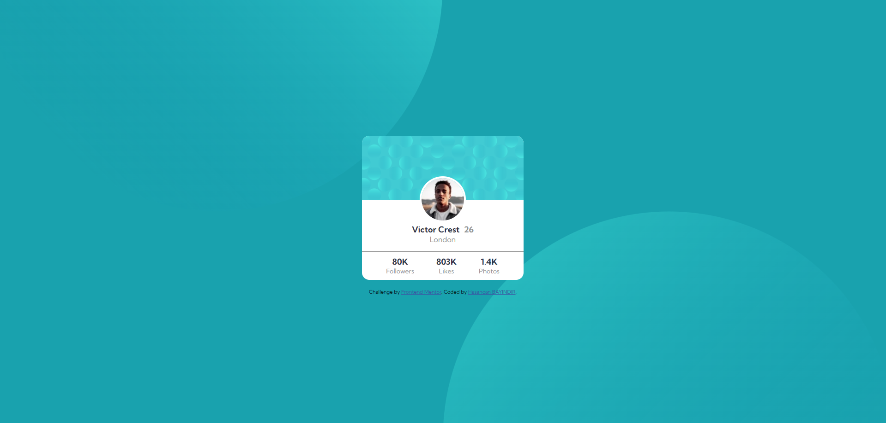

# Frontend Mentor - Profile card component



# Frontend Mentor - Profile card component solution

## My process

### Built with

- Semantic HTML5 markup
- Flexbox

### What I learned

- How to position an image

```css

body {
    background-color: hsl(185, 75%, 39%);
    font-family: 'Kumbh Sans', sans-serif;
    background-image: url(/images/bg-pattern-top.svg), url(/images/bg-pattern-bottom.svg);
    background-repeat: no-repeat, no-repeat;
    background-position: right 50vw bottom 50vh, left 50vw top 50vh;
    display: flex;
    align-items: center;
    min-height: 100vh;
}

.line {
    display: block;
    border-bottom: 1px solid hsl(0, 0%, 59%);
    margin-top: 1rem;
}
```

## Author

- Github - [Add your name here](https://www.your-site.com)
- Frontend Mentor - [@bayindirhsncn](https://www.frontendmentor.io/profile/bayindirhsncn)